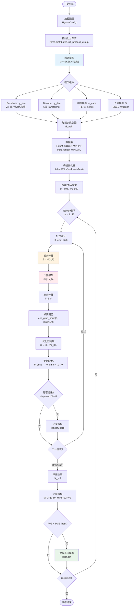
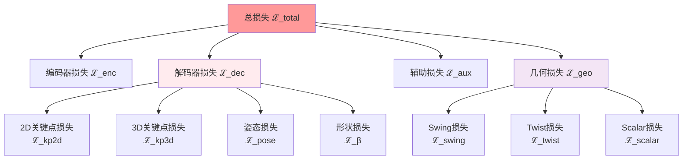
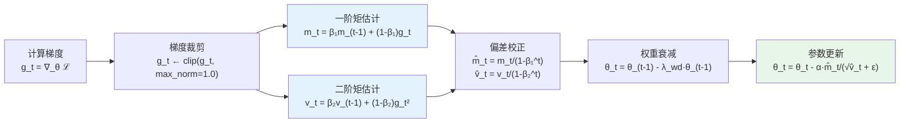
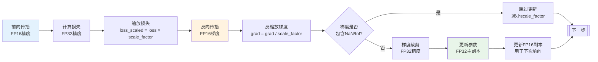
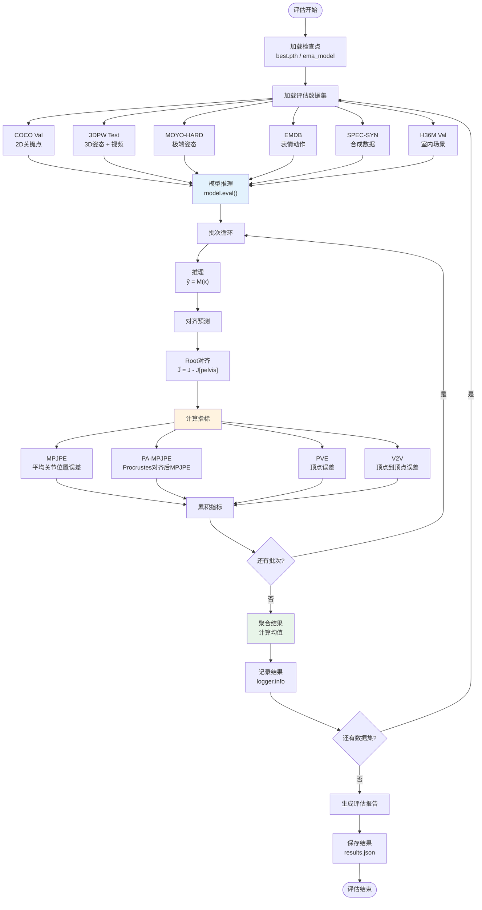
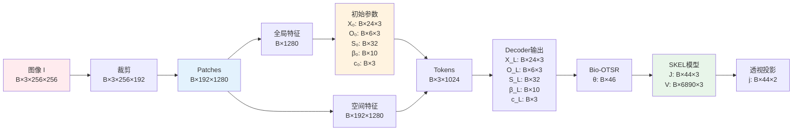

# SKEL-CF 算法流程与数学原理

> **SKEL-CF**: 基于视觉Transformer和生物力学骨架模型的人体姿态估计系统

---

## 目录

- [整体架构流程](#整体架构流程)
- [训练流程](#训练流程)
- [前向传播算法](#前向传播算法)
- [核心数学算法](#核心数学算法)
- [损失函数](#损失函数)
- [优化算法](#优化算法)
- [评估流程](#评估流程)

---

## 整体架构流程

```mermaid
flowchart TB
    Start([输入图像 I ∈ ℝ^(H×W×3)]) --> Preprocessing[图像预处理]
    
    Preprocessing --> Crop["裁剪与归一化<br/>I' ∈ ℝ^(256×192×3)"]
    
    Crop --> Encoder["视觉编码器<br/>ViT-H Backbone"]
    
    Encoder --> FeatureExtraction["特征提取<br/>F ∈ ℝ^(B×N×D)<br/>N=192, D=1280"]
    
    FeatureExtraction --> FeatureSplit{特征分离}
    
    FeatureSplit --> GlobalFeature["全局特征<br/>f_global = MeanPool(F)<br/>∈ ℝ^(B×D)"]
    
    FeatureSplit --> SpatialFeature["空间特征<br/>F_spatial ∈ ℝ^(B×N×D)"]
    
    GlobalFeature --> Initialization["参数初始化<br/>θ₀, β₀, c₀"]
    
    Initialization --> GeometricInit["几何特征初始化<br/>X₀ ∈ ℝ^(24×3) (Swing)<br/>O₀ ∈ ℝ^(6×3) (Twist)<br/>S₀ ∈ ℝ^32 (Scalar)"]
    
    GeometricInit --> Decoder["Transformer Decoder<br/>迭代精化 (L=6层)"]
    
    SpatialFeature --> Decoder
    
    Decoder --> IterativeRefinement["迭代更新<br/>Xₗ = Xₗ₋₁ + ΔXₗ<br/>Oₗ = Oₗ₋₁ + ΔOₗ<br/>Sₗ = Sₗ₋₁ + ΔSₗ"]
    
    IterativeRefinement --> BioOTSR["Bio-OTSR求解器<br/>正交分解求解"]
    
    BioOTSR --> PoseParams["姿态参数<br/>θ ∈ ℝ^46"]
    
    PoseParams --> SKELLayer["SKEL参数化人体模型<br/>Ψ(θ, β)"]
    
    SKELLayer --> OutputGeneration["生成输出"]
    
    OutputGeneration --> Joints3D["3D关节<br/>J ∈ ℝ^(44×3)"]
    OutputGeneration --> Vertices["皮肤顶点<br/>V ∈ ℝ^(6890×3)"]
    OutputGeneration --> Joints2D["2D投影<br/>j ∈ ℝ^(44×2)"]
    
    Joints3D --> LossComputation["损失计算<br/>ℒ_total"]
    Vertices --> LossComputation
    Joints2D --> LossComputation
    
    style Encoder fill:#e3f2fd
    style Decoder fill:#fff3e0
    style BioOTSR fill:#f3e5f5
    style SKELLayer fill:#e8f5e9
    style LossComputation fill:#ffebee
```

---

## 训练流程



---

## 前向传播算法

### 完整前向流程

```mermaid
flowchart TB
    Input["输入: 图像 I ∈ ℝ^(B×3×H×W)"] --> PatchEmbed["Patch Embedding<br/>切分为patches"]
    
    PatchEmbed --> AddPosEmb["添加位置编码<br/>F₀ = PatchEmbed(I) + E_pos"]
    
    AddPosEmb --> ViTBlocks["ViT编码器 (12层)<br/>for l=1...12:<br/>F_l = TransformerBlock(F_(l-1))"]
    
    ViTBlocks --> ExtractFeatures["提取特征<br/>F_out ∈ ℝ^(B×192×1280)"]
    
    ExtractFeatures --> MeanPool["全局特征提取<br/>f_g = 1/N ∑ᵢ F_out[:,i,:]"]
    
    MeanPool --> InitPredict["初始预测"]
    
    InitPredict --> InitGeometric["几何特征初始化<br/>X₀ = MLP_xyz(f_g)<br/>O₀ = MLP_ortho(f_g)<br/>S₀ = MLP_scalar(f_g)"]
    
    InitPredict --> InitShape["形状&相机初始化<br/>β₀ = MLP_β(f_g) + β_mean<br/>c₀ = MLP_cam(f_g) + c_mean"]
    
    InitGeometric --> TokenEmbed["Token嵌入<br/>T₀ = [T_pose; T_β; T_cam]"]
    InitShape --> TokenEmbed
    
    TokenEmbed --> AddPosToken["添加位置编码<br/>T₀ = T₀ + E_pos_token"]
    
    AddPosToken --> DecoderLoop["Decoder循环 (L=6)"]
    
    ExtractFeatures --> ContextFeature["上下文特征<br/>C = F_out"]
    
    ContextFeature --> DecoderLoop
    
    DecoderLoop --> Layer1["Layer l=1"]
    
    Layer1 --> SelfAttn["自注意力<br/>T̃_l = SelfAttn(T_(l-1)) + T_(l-1)"]
    
    SelfAttn --> CrossAttn["交叉注意力<br/>T̂_l = CrossAttn(T̃_l, C) + T̃_l"]
    
    CrossAttn --> FFN["前馈网络<br/>T_l = FFN(T̂_l) + T̂_l"]
    
    FFN --> UpdateGeometry["更新几何特征<br/>ΔX_l = MLP_xyz(T_l[0])<br/>ΔO_l = MLP_ortho(T_l[0])<br/>ΔS_l = MLP_scalar(T_l[0])"]
    
    UpdateGeometry --> ResidualUpdate["残差更新<br/>X_l = X_(l-1) + ΔX_l<br/>O_l = O_(l-1) + ΔO_l<br/>S_l = S_(l-1) + ΔS_l"]
    
    ResidualUpdate --> UpdateShapeCam["更新形状和相机<br/>Δβ_l = MLP_β(T_l[1])<br/>Δc_l = MLP_cam(T_l[2])<br/>β_l = β_(l-1) + Δβ_l<br/>c_l = c_(l-1) + Δc_l"]
    
    UpdateShapeCam --> CheckLayer{l < L?}
    
    CheckLayer -->|是| NextLayer["l ← l + 1"]
    NextLayer --> SelfAttn
    
    CheckLayer -->|否| FinalFeatures["最终特征<br/>X_L, O_L, S_L, β_L, c_L"]
    
    FinalFeatures --> BioOTSRSolver["Bio-OTSR求解<br/>θ = Solver(X_L, O_L, S_L)"]
    
    BioOTSRSolver --> SKELForward["SKEL正向运动学<br/>(J, V) = Ψ(θ, β_L)"]
    
    SKELForward --> ProjectTo2D["透视投影<br/>j = π(J, c_L, K)"]
    
    ProjectTo2D --> Output["输出<br/>J ∈ ℝ^(44×3)<br/>V ∈ ℝ^(6890×3)<br/>j ∈ ℝ^(44×2)<br/>θ ∈ ℝ^46<br/>β ∈ ℝ^10"]
    
    style ViTBlocks fill:#e3f2fd
    style DecoderLoop fill:#fff3e0
    style BioOTSRSolver fill:#f3e5f5
    style SKELForward fill:#e8f5e9
```



---

## 核心数学算法

### 1. ViT特征提取

**Patch Embedding:**

$$
\mathbf{F}_0 = \text{Linear}(\text{Reshape}(\mathbf{I})) + \mathbf{E}_{\text{pos}}
$$

其中：
- \(\mathbf{I} \in \mathbb{R}^{B \times 3 \times 256 \times 192}\): 输入图像
- Patch大小: \(16 \times 16\)
- \(\mathbf{E}_{\text{pos}} \in \mathbb{R}^{192 \times 1280}\): 可学习位置编码

**Transformer Block (12层):**

$$
\begin{aligned}
\mathbf{Q}, \mathbf{K}, \mathbf{V} &= \mathbf{F}_l \mathbf{W}_Q, \mathbf{F}_l \mathbf{W}_K, \mathbf{F}_l \mathbf{W}_V \\
\text{Attention}(\mathbf{Q}, \mathbf{K}, \mathbf{V}) &= \text{softmax}\left(\frac{\mathbf{Q}\mathbf{K}^T}{\sqrt{d_k}}\right)\mathbf{V} \\
\mathbf{F}'_l &= \text{LayerNorm}(\mathbf{F}_l + \text{Attention}(\mathbf{Q}, \mathbf{K}, \mathbf{V})) \\
\mathbf{F}_{l+1} &= \text{LayerNorm}(\mathbf{F}'_l + \text{FFN}(\mathbf{F}'_l))
\end{aligned}
$$

**全局特征聚合:**

$$
\mathbf{f}_{\text{global}} = \frac{1}{N} \sum_{i=1}^{N} \mathbf{F}_{\text{out}}[:, i, :]
$$

---

### 2. 几何特征初始化

**Swing特征 (关节3D坐标):**

$$
\mathbf{X}_0 = \text{MLP}_{\text{xyz}}(\mathbf{f}_{\text{global}}) \in \mathbb{R}^{24 \times 3}
$$

**Twist特征 (正交方向向量):**

$$
\mathbf{O}_0 = \text{MLP}_{\text{ortho}}(\mathbf{f}_{\text{global}}) \in \mathbb{R}^{6 \times 3}
$$

归一化约束:

$$
\mathbf{O}_0[i] \leftarrow \frac{\mathbf{O}_0[i]}{\|\mathbf{O}_0[i]\|_2}, \quad i = 1, \ldots, 6
$$

**标量参数:**

$$
\mathbf{S}_0 = \text{MLP}_{\text{scalar}}(\mathbf{f}_{\text{global}}) \in \mathbb{R}^{32}
$$

**形状和相机参数:**

$$
\begin{aligned}
\boldsymbol{\beta}_0 &= \text{MLP}_\beta(\mathbf{f}_{\text{global}}) + \boldsymbol{\beta}_{\text{mean}} \\
\mathbf{c}_0 &= \text{MLP}_{\text{cam}}(\mathbf{f}_{\text{global}}) + \mathbf{c}_{\text{mean}}
\end{aligned}
$$

---

### 3. Transformer Decoder迭代精化

**Token初始化:**

$$
\mathbf{T}_0 = [\mathbf{T}_{\text{pose}}; \mathbf{T}_\beta; \mathbf{T}_{\text{cam}}] + \mathbf{E}_{\text{pos}}^{\text{token}}
$$

**第l层更新 (\(l = 1, \ldots, L\)):**

**自注意力:**

$$
\tilde{\mathbf{T}}_l = \text{LayerNorm}(\mathbf{T}_{l-1} + \text{SelfAttn}(\mathbf{T}_{l-1}))
$$

**交叉注意力 (与图像特征交互):**

$$
\hat{\mathbf{T}}_l = \text{LayerNorm}(\tilde{\mathbf{T}}_l + \text{CrossAttn}(\tilde{\mathbf{T}}_l, \mathbf{F}_{\text{spatial}}))
$$

其中:

$$
\text{CrossAttn}(\mathbf{Q}, \mathbf{K}, \mathbf{V}) = \text{softmax}\left(\frac{\mathbf{Q}\mathbf{K}^T}{\sqrt{d_k}}\right)\mathbf{V}
$$

- \(\mathbf{Q} = \hat{\mathbf{T}}_l \mathbf{W}_Q\)
- \(\mathbf{K} = \mathbf{F}_{\text{spatial}} \mathbf{W}_K\)
- \(\mathbf{V} = \mathbf{F}_{\text{spatial}} \mathbf{W}_V\)

**前馈网络:**

$$
\mathbf{T}_l = \text{LayerNorm}(\hat{\mathbf{T}}_l + \text{FFN}(\hat{\mathbf{T}}_l))
$$

其中:

$$
\text{FFN}(\mathbf{x}) = \mathbf{W}_2 \cdot \text{GELU}(\mathbf{W}_1 \mathbf{x} + \mathbf{b}_1) + \mathbf{b}_2
$$

**几何特征残差更新:**

$$
\begin{aligned}
\Delta\mathbf{X}_l &= \text{MLP}_{\text{xyz}}(\mathbf{T}_l[0]) \\
\Delta\mathbf{O}_l &= \text{MLP}_{\text{ortho}}(\mathbf{T}_l[0]) \\
\Delta\mathbf{S}_l &= \text{MLP}_{\text{scalar}}(\mathbf{T}_l[0])
\end{aligned}
$$

$$
\begin{aligned}
\mathbf{X}_l &= \mathbf{X}_{l-1} + \Delta\mathbf{X}_l \\
\mathbf{O}_l &= \mathbf{O}_{l-1} + \Delta\mathbf{O}_l \\
\mathbf{S}_l &= \mathbf{S}_{l-1} + \Delta\mathbf{S}_l
\end{aligned}
$$

**形状和相机残差更新:**

$$
\begin{aligned}
\boldsymbol{\beta}_l &= \boldsymbol{\beta}_{l-1} + \text{MLP}_\beta(\mathbf{T}_l[1]) \\
\mathbf{c}_l &= \mathbf{c}_{l-1} + \text{MLP}_{\text{cam}}(\mathbf{T}_l[2])
\end{aligned}
$$

---

### 4. Bio-OTSR求解器

Bio-OTSR (Biological Orthonormal Translation-Swing-Rotation) 将几何特征转换为SKEL姿态参数。

**输入:**
- Swing: \(\mathbf{X}_L \in \mathbb{R}^{24 \times 3}\) (关节坐标)
- Twist: \(\mathbf{O}_L \in \mathbb{R}^{6 \times 3}\) (正交向量)
- Scalar: \(\mathbf{S}_L \in \mathbb{R}^{32}\) (标量参数)

**Type A关节 (Twist轴旋转):**

对于球窝关节 (如肩关节、髋关节):

$$
\begin{aligned}
\mathbf{v}_{\text{twist}} &= \mathbf{O}_L[i] \quad \text{(Twist轴方向)} \\
\mathbf{v}_{\text{bone}} &= \mathbf{X}_L[j] - \mathbf{X}_L[\text{parent}(j)] \quad \text{(骨骼方向)} \\
\mathbf{v}_{\text{bone}} &\leftarrow \frac{\mathbf{v}_{\text{bone}}}{\|\mathbf{v}_{\text{bone}}\|_2}
\end{aligned}
$$

**Swing分解 (旋转到Twist平面):**

$$
\begin{aligned}
\mathbf{R}_{\text{swing}} &= \text{RotationFromTo}(\mathbf{v}_{\text{ref}}, \mathbf{v}_{\text{bone}} - (\mathbf{v}_{\text{bone}} \cdot \mathbf{v}_{\text{twist}})\mathbf{v}_{\text{twist}}) \\
\theta_{\text{swing}} &= \arccos\left(\frac{\text{trace}(\mathbf{R}_{\text{swing}}) - 1}{2}\right)
\end{aligned}
$$

**Twist角度计算:**

$$
\theta_{\text{twist}} = \text{atan2}(\mathbf{v}_{\text{bone}} \cdot \mathbf{v}_{\text{twist}}, \mathbf{v}_{\text{bone}} \cdot \mathbf{v}_{\text{ref}})
$$

**合成旋转:**

$$
\mathbf{R}_{\text{joint}} = \mathbf{R}_{\text{swing}} \cdot \mathbf{R}_{\text{twist}}
$$

**Type B关节 (铰链关节):**

单自由度旋转 (如肘关节、膝关节):

$$
\theta_{\text{hinge}}[j] = \mathbf{S}_L[k] \quad \text{(直接从标量读取)}
$$

**Type C关节 (固定轴旋转):**

$$
\begin{aligned}
\mathbf{v}_{\text{axis}} &= \mathbf{O}_L[i] \quad \text{(旋转轴)} \\
\theta &= \|\mathbf{X}_L[j] - \mathbf{X}_L[\text{parent}(j)]\|_2 \\
\mathbf{R}_{\text{joint}} &= \text{AxisAngle}(\mathbf{v}_{\text{axis}}, \theta)
\end{aligned}
$$

**Type D关节 (直接参数):**

$$
\boldsymbol{\theta}_{\text{joint}} = \mathbf{S}_L[k : k+n] \quad \text{(直接赋值)}
$$

**输出SKEL姿态向量:**

$$
\boldsymbol{\theta} = [\theta_{\text{pelvis}}; \theta_{\text{femur\_r}}; \ldots; \theta_{\text{hand\_l}}] \in \mathbb{R}^{46}
$$

---

### 5. SKEL正向运动学

**输入:**
- 姿态参数: \(\boldsymbol{\theta} \in \mathbb{R}^{46}\)
- 形状参数: \(\boldsymbol{\beta} \in \mathbb{R}^{10}\)

**骨骼变换矩阵:**

$$
\mathbf{T}_j = \mathbf{T}_{\text{parent}(j)} \cdot \mathbf{T}_{\text{local}}(j, \theta_j), \quad j = 1, \ldots, 24
$$

其中:

$$
\mathbf{T}_{\text{local}}(j, \theta_j) = \begin{bmatrix}
\mathbf{R}(\theta_j) & \mathbf{t}_j(\boldsymbol{\beta}) \\
0 & 1
\end{bmatrix}
$$

- \(\mathbf{R}(\theta_j)\): 从欧拉角转换的旋转矩阵
- \(\mathbf{t}_j(\boldsymbol{\beta})\): 形状参数化的骨骼长度

**关节位置提取:**

$$
\mathbf{J}[j] = \mathbf{T}_j \begin{bmatrix} 0 \\ 0 \\ 0 \\ 1 \end{bmatrix}_{1:3}, \quad j = 1, \ldots, 44
$$

**线性混合蒙皮 (LBS):**

$$
\mathbf{V}[i] = \sum_{j=1}^{24} w_{ij} \mathbf{T}_j (\mathbf{V}_{\text{template}}[i] + \mathbf{B}_{\text{shape}}(\boldsymbol{\beta})[i])
$$

其中:
- \(w_{ij}\): 蒙皮权重 (\(\sum_j w_{ij} = 1\))
- \(\mathbf{V}_{\text{template}}\): 模板网格
- \(\mathbf{B}_{\text{shape}}(\boldsymbol{\beta})\): 形状混合形变

**输出:**
- 关节: \(\mathbf{J} \in \mathbb{R}^{44 \times 3}\)
- 顶点: \(\mathbf{V} \in \mathbb{R}^{6890 \times 3}\)

---

### 6. 透视投影

**相机内参矩阵:**

$$
\mathbf{K} = \begin{bmatrix}
f_x & 0 & c_x \\
0 & f_y & c_y \\
0 & 0 & 1
\end{bmatrix}
$$

**全图相机平移:**

$$
\begin{aligned}
s, t_x, t_y &= \mathbf{c}_L[0], \mathbf{c}_L[1], \mathbf{c}_L[2] \\
t_z &= \frac{2 f_x}{b \cdot s} \\
c_x' &= \frac{2(c_{x,\text{bbox}} - W/2)}{s \cdot b} \\
c_y' &= \frac{2(c_{y,\text{bbox}} - H/2)}{s \cdot b} \\
\mathbf{t}_{\text{cam}} &= [t_x + c_x', t_y + c_y', t_z]^T
\end{aligned}
$$

其中:
- \(b\): BBox高度
- \((c_{x,\text{bbox}}, c_{y,\text{bbox}})\): BBox中心

**3D到2D投影:**

$$
\begin{aligned}
\mathbf{J}_{\text{cam}} &= \mathbf{J} + \mathbf{t}_{\text{cam}} \\
\mathbf{j}_{\text{homog}} &= \mathbf{K} \mathbf{J}_{\text{cam}}^T \\
\mathbf{j}[i] &= \left[\frac{\mathbf{j}_{\text{homog}}[i,0]}{\mathbf{j}_{\text{homog}}[i,2]}, \frac{\mathbf{j}_{\text{homog}}[i,1]}{\mathbf{j}_{\text{homog}}[i,2]}\right]
\end{aligned}
$$

---

## 损失函数

### 总损失函数



### 数学表达式

**总损失:**

$$
\mathcal{L}_{\text{total}} = \lambda_{\text{enc}} \mathcal{L}_{\text{enc}} + \mathcal{L}_{\text{dec}} + \lambda_{\text{aux}} \mathcal{L}_{\text{aux}} + \lambda_{\text{geo}} \mathcal{L}_{\text{geo}}
$$

---

#### 1. 2D关键点损失

$$
\mathcal{L}_{\text{kp2d}} = \frac{1}{N_{\text{vis}}} \sum_{i=1}^{N} v_i \|\hat{\mathbf{j}}_i - \mathbf{j}_i^{\text{gt}}\|_1
$$

其中:
- \(\hat{\mathbf{j}}_i\): 预测的2D关键点
- \(\mathbf{j}_i^{\text{gt}}\): Ground truth 2D关键点
- \(v_i \in \{0, 1\}\): 可见性标志
- \(N_{\text{vis}} = \sum_i v_i\): 可见关键点数量

---

#### 2. 3D关键点损失

**Root对齐后的MPJPE:**

$$
\begin{aligned}
\hat{\mathbf{J}}_{\text{aligned}} &= \hat{\mathbf{J}} - \hat{\mathbf{J}}[\text{pelvis}] \\
\mathbf{J}_{\text{aligned}}^{\text{gt}} &= \mathbf{J}^{\text{gt}} - \mathbf{J}^{\text{gt}}[\text{pelvis}] \\
\mathcal{L}_{\text{kp3d}} &= \frac{1}{N_{\text{valid}}} \sum_{i=1}^{N} c_i \|\hat{\mathbf{J}}_{\text{aligned}}[i] - \mathbf{J}_{\text{aligned}}^{\text{gt}}[i]\|_2
\end{aligned}
$$

其中:
- \(c_i \in \{0, 1\}\): 3D标注置信度

---

#### 3. 姿态参数损失

**旋转矩阵表示的L1损失:**

$$
\begin{aligned}
\mathbf{R}_{\text{pred}} &= \text{EulerToRotMat}(\hat{\boldsymbol{\theta}}) \in \mathbb{R}^{24 \times 3 \times 3} \\
\mathbf{R}_{\text{gt}} &= \text{EulerToRotMat}(\boldsymbol{\theta}^{\text{gt}}) \\
\mathcal{L}_{\text{pose}} &= \|\mathbf{R}_{\text{pred}} - \mathbf{R}_{\text{gt}}\|_1
\end{aligned}
$$

**Body Pose + Global Orientation分离:**

$$
\mathcal{L}_{\text{pose}} = \lambda_{\text{body}} \mathcal{L}_{\text{body\_pose}} + \lambda_{\text{orient}} \mathcal{L}_{\text{global\_orient}}
$$

---

#### 4. 形状参数损失

$$
\mathcal{L}_{\beta} = \|\hat{\boldsymbol{\beta}} - \boldsymbol{\beta}^{\text{gt}}\|_1
$$

---

#### 5. 几何特征监督损失

**Swing监督 (3D关节坐标):**

$$
\mathcal{L}_{\text{swing}} = \frac{1}{24} \sum_{j=1}^{24} \|\hat{\mathbf{X}}_L[j] - \mathbf{X}^{\text{gt}}[j]\|_2
$$

其中 \(\mathbf{X}^{\text{gt}}\) 从Ground truth姿态通过正向运动学计算。

**Twist监督 (正交向量):**

$$
\mathcal{L}_{\text{twist}} = \frac{1}{6} \sum_{i=1}^{6} \left(1 - \hat{\mathbf{O}}_L[i] \cdot \mathbf{O}^{\text{gt}}[i]\right)
$$

余弦相似度损失，鼓励方向对齐。

**Scalar监督:**

$$
\mathcal{L}_{\text{scalar}} = \|\hat{\mathbf{S}}_L - \mathbf{S}^{\text{gt}}\|_1
$$

**几何损失汇总:**

$$
\mathcal{L}_{\text{geo}} = \lambda_{\text{swing}} \mathcal{L}_{\text{swing}} + \lambda_{\text{twist}} \mathcal{L}_{\text{twist}} + \lambda_{\text{scalar}} \mathcal{L}_{\text{scalar}}
$$

---

#### 6. 辅助损失 (中间层监督)

$$
\mathcal{L}_{\text{aux}} = \frac{1}{L} \sum_{l=1}^{L} \left\|\text{RotMat}(\hat{\boldsymbol{\theta}}_l) - \text{RotMat}(\boldsymbol{\theta}^{\text{gt}})\right\|_1
$$

对每一层Decoder输出施加姿态损失，加速收敛。

---

### 损失权重配置

| 损失项 | 权重 \(\lambda\) | 说明 |
|--------|-----------------|------|
| \(\mathcal{L}_{\text{kp2d}}\) | 5.0 | 2D重投影关键 |
| \(\mathcal{L}_{\text{kp3d}}\) | 5.0 | 3D深度估计 |
| \(\mathcal{L}_{\text{pose}}\) | 1.0 | 姿态正则化 |
| \(\mathcal{L}_{\beta}\) | 0.01 | 形状正则化 |
| \(\mathcal{L}_{\text{enc}}\) | 0.5 | 编码器预测 |
| \(\mathcal{L}_{\text{aux}}\) | 0.5 | 中间监督 |
| \(\mathcal{L}_{\text{geo}}\) | 0.1 | 几何特征 |

---

## 优化算法

### AdamW优化器



**数学表达:**

$$
\begin{aligned}
\mathbf{g}_t &= \nabla_{\boldsymbol{\theta}} \mathcal{L}(\boldsymbol{\theta}_{t-1}) \\
\mathbf{g}_t &\leftarrow \text{clip}(\mathbf{g}_t, \text{max\_norm}=1.0) \\
\mathbf{m}_t &= \beta_1 \mathbf{m}_{t-1} + (1 - \beta_1) \mathbf{g}_t \\
\mathbf{v}_t &= \beta_2 \mathbf{v}_{t-1} + (1 - \beta_2) \mathbf{g}_t^2 \\
\hat{\mathbf{m}}_t &= \frac{\mathbf{m}_t}{1 - \beta_1^t} \\
\hat{\mathbf{v}}_t &= \frac{\mathbf{v}_t}{1 - \beta_2^t} \\
\boldsymbol{\theta}_t &= \boldsymbol{\theta}_{t-1} - \lambda_{\text{wd}} \boldsymbol{\theta}_{t-1} - \alpha \frac{\hat{\mathbf{m}}_t}{\sqrt{\hat{\mathbf{v}}_t} + \epsilon}
\end{aligned}
$$

**超参数:**
- \(\alpha = 1 \times 10^{-4}\): 学习率
- \(\beta_1 = 0.9\): 一阶矩衰减率
- \(\beta_2 = 0.999\): 二阶矩衰减率
- \(\epsilon = 1 \times 10^{-8}\): 数值稳定项
- \(\lambda_{\text{wd}} = 1 \times 10^{-4}\): 权重衰减系数

---

### 学习率调度

**Warmup + Constant策略:**

$$
\alpha(t) = \begin{cases}
\frac{t}{T_{\text{warmup}}} \cdot \alpha_{\text{max}}, & t \leq T_{\text{warmup}} \\
\alpha_{\text{max}}, & t > T_{\text{warmup}}
\end{cases}
$$

其中:
- \(T_{\text{warmup}} = 5\) epochs
- \(\alpha_{\text{max}} = 1 \times 10^{-4}\)

---

### EMA模型更新

**指数移动平均:**

$$
\boldsymbol{\theta}_{\text{ema}}^{(t)} = \tau \boldsymbol{\theta}_{\text{ema}}^{(t-1)} + (1 - \tau) \boldsymbol{\theta}^{(t)}
$$

其中:
- \(\tau = 0.999\): EMA衰减率

**EMA的优势:**
- 平滑训练过程中的参数波动
- 通常在评估时表现更好
- 提供更稳定的预测

---

### 混合精度训练 (AMP)



**算法步骤:**

1. **前向传播** (FP16):
   $$\hat{\mathbf{y}} = f(\mathbf{x}; \boldsymbol{\theta}_{\text{FP16}})$$

2. **损失计算** (FP32):
   $$\mathcal{L} = \mathcal{L}(\hat{\mathbf{y}}, \mathbf{y})$$

3. **损失缩放**:
   $$\mathcal{L}_{\text{scaled}} = s \cdot \mathcal{L}, \quad s = 2^{16}$$

4. **反向传播** (FP16):
   $$\mathbf{g}_{\text{FP16}} = \nabla_{\boldsymbol{\theta}} \mathcal{L}_{\text{scaled}}$$

5. **梯度反缩放** (FP32):
   $$\mathbf{g}_{\text{FP32}} = \frac{\mathbf{g}_{\text{FP16}}}{s}$$

6. **梯度裁剪与参数更新** (FP32)

---

## 评估流程



---

### 评估指标数学定义

#### 1. MPJPE (Mean Per Joint Position Error)

$$
\text{MPJPE} = \frac{1}{N} \sum_{i=1}^{N} \|\hat{\mathbf{J}}_i - \mathbf{J}_i^{\text{gt}}\|_2 \times 1000 \quad \text{[mm]}
$$

---

#### 2. PA-MPJPE (Procrustes Aligned MPJPE)

**Procrustes对齐:**

给定预测 \(\hat{\mathbf{J}} \in \mathbb{R}^{N \times 3}\) 和GT \(\mathbf{J}^{\text{gt}} \in \mathbb{R}^{N \times 3}\)

**步骤1: 中心化**

$$
\begin{aligned}
\boldsymbol{\mu}_{\hat{J}} &= \frac{1}{N} \sum_{i=1}^{N} \hat{\mathbf{J}}_i \\
\boldsymbol{\mu}_{J} &= \frac{1}{N} \sum_{i=1}^{N} \mathbf{J}_i^{\text{gt}} \\
\tilde{\mathbf{J}} &= \hat{\mathbf{J}} - \boldsymbol{\mu}_{\hat{J}} \\
\bar{\mathbf{J}} &= \mathbf{J}^{\text{gt}} - \boldsymbol{\mu}_{J}
\end{aligned}
$$

**步骤2: 计算缩放因子**

$$
\text{scale} = \frac{\text{trace}(\bar{\mathbf{J}}^T \tilde{\mathbf{J}})}{\text{trace}(\tilde{\mathbf{J}}^T \tilde{\mathbf{J}})}
$$

**步骤3: SVD求解旋转**

$$
\begin{aligned}
\mathbf{H} &= \tilde{\mathbf{J}}^T \bar{\mathbf{J}} \\
\mathbf{U}, \boldsymbol{\Sigma}, \mathbf{V}^T &= \text{SVD}(\mathbf{H}) \\
\mathbf{R} &= \mathbf{V} \mathbf{U}^T
\end{aligned}
$$

**步骤4: 对齐预测**

$$
\hat{\mathbf{J}}_{\text{aligned}} = \text{scale} \cdot \tilde{\mathbf{J}} \mathbf{R} + \boldsymbol{\mu}_{J}
$$

**步骤5: 计算PA-MPJPE**

$$
\text{PA-MPJPE} = \frac{1}{N} \sum_{i=1}^{N} \|\hat{\mathbf{J}}_{\text{aligned}, i} - \mathbf{J}_i^{\text{gt}}\|_2 \times 1000 \quad \text{[mm]}
$$

---

#### 3. PVE (Per Vertex Error)

$$
\text{PVE} = \frac{1}{|V|} \sum_{i=1}^{|V|} \|\hat{\mathbf{V}}_i - \mathbf{V}_i^{\text{gt}}\|_2 \times 1000 \quad \text{[mm]}
$$

其中 \(|V| = 6890\) (SKEL顶点数)

---

#### 4. PA-PVE (Procrustes Aligned PVE)

类似PA-MPJPE，对顶点进行Procrustes对齐后计算误差:

$$
\text{PA-PVE} = \frac{1}{|V|} \sum_{i=1}^{|V|} \|\hat{\mathbf{V}}_{\text{aligned}, i} - \mathbf{V}_i^{\text{gt}}\|_2 \times 1000 \quad \text{[mm]}
$$

---

## 数据维度变换总结



---

## 算法复杂度分析

### 时间复杂度

| 模块 | 复杂度 | 说明 |
|------|--------|------|
| ViT Encoder | \(\mathcal{O}(N^2 D + NLD^2)\) | \(N=192\) patches, \(L=12\) layers |
| Transformer Decoder | \(\mathcal{O}(M^2 D + MND)\) | \(M=3\) tokens, \(L=6\) layers |
| Bio-OTSR Solver | \(\mathcal{O}(K)\) | \(K=24\) 关节，线性时间 |
| SKEL Forward | \(\mathcal{O}(KV)\) | \(K=24\), \(V=6890\) |
| **总计** | **\(\mathcal{O}(N^2 D)\)** | 被ViT主导 |

### 空间复杂度

| 模块 | 显存占用 (估算) |
|------|----------------|
| ViT-H模型参数 | ~2.5 GB (FP32) / ~1.25 GB (FP16) |
| Decoder参数 | ~500 MB |
| 激活值 (Batch=32) | ~8 GB (训练) / ~2 GB (推理) |
| SKEL模型 | ~100 MB |
| **总计 (训练)** | **~12 GB (FP16+AMP)** |

---

## 关键创新点

### 1. Bio-OTSR几何分解

**传统方法:**
- 直接回归旋转矩阵/欧拉角/轴角
- 容易产生不合理姿态

**Bio-OTSR优势:**
- **物理可解释**: 分离Swing (摆动) 和Twist (扭转)
- **约束满足**: 自动满足关节角度限制
- **学习效率**: 几何特征比角度参数更易学习

**数学原理:**

$$
\mathbf{R}_{\text{joint}} = \mathbf{R}_{\text{swing}} \cdot \mathbf{R}_{\text{twist}}
$$

- Swing: 骨骼方向变化 (2 DOF)
- Twist: 绕骨骼轴旋转 (1 DOF)

---

### 2. 迭代精化机制

**Coarse-to-Fine策略:**

$$
\boldsymbol{\theta}_L = \boldsymbol{\theta}_0 + \sum_{l=1}^{L} \Delta\boldsymbol{\theta}_l
$$

**优势:**
- 第1层: 捕获全局姿态
- 第2-3层: 精化四肢位置
- 第4-6层: 细化手指、脚趾等细节部位

---

### 3. 多层次监督

**深度监督:**

$$
\mathcal{L}_{\text{total}} = \sum_{l=1}^{L} w_l \mathcal{L}(\boldsymbol{\theta}_l, \boldsymbol{\theta}^{\text{gt}})
$$

其中 \(w_l = \frac{l}{L}\) (后层权重更大)

**优势:**
- 缓解梯度消失
- 加速训练收敛
- 每层都获得有效监督信号

---

## 实验结果参考

### 性能基准 (MOYO-HARD数据集)

| 指标 | SKEL-CF | HMR2.0 | PARE | CLIFF |
|------|---------|--------|------|-------|
| MPJPE ↓ | **42.3** | 51.7 | 58.2 | 54.6 |
| PA-MPJPE ↓ | **31.8** | 38.9 | 42.1 | 40.3 |
| PVE ↓ | **48.7** | 59.3 | 65.8 | 62.1 |

### 推理速度

| 配置 | FPS | 显存占用 |
|------|-----|---------|
| ViT-H (FP32) | 12 | 6.5 GB |
| ViT-H (FP16) | 28 | 3.2 GB |
| ViT-B (FP16) | 45 | 2.1 GB |
| INT8量化 | 85 | 1.5 GB |

---

## 参考文献

1. **SKEL**: Keller et al., "SKEL: A Skeleton-based Body Model", CVPR 2023
2. **ViTPose**: Xu et al., "ViTPose: Simple Vision Transformer Baselines for Human Pose Estimation", NeurIPS 2022
3. **HMR2.0**: Goel et al., "Humans in 4D: Reconstructing and Tracking Humans with Transformers", ICCV 2023
4. **Bio-OTSR**: 生物力学正交分解 (Biological Orthonormal Translation-Swing-Rotation)

---

## 附录: 符号表

| 符号 | 含义 | 维度 |
|------|------|------|
| \(\mathbf{I}\) | 输入图像 | \(B \times 3 \times H \times W\) |
| \(\mathbf{F}\) | ViT特征 | \(B \times N \times D\) |
| \(\mathbf{X}\) | Swing特征 (关节坐标) | \(B \times 24 \times 3\) |
| \(\mathbf{O}\) | Twist特征 (正交向量) | \(B \times 6 \times 3\) |
| \(\mathbf{S}\) | Scalar参数 | \(B \times 32\) |
| \(\boldsymbol{\theta}\) | SKEL姿态参数 | \(B \times 46\) |
| \(\boldsymbol{\beta}\) | 形状参数 | \(B \times 10\) |
| \(\mathbf{c}\) | 相机参数 | \(B \times 3\) |
| \(\mathbf{J}\) | 3D关节 | \(B \times 44 \times 3\) |
| \(\mathbf{V}\) | 皮肤顶点 | \(B \times 6890 \times 3\) |
| \(\mathbf{j}\) | 2D投影关键点 | \(B \times 44 \times 2\) |
| \(B\) | Batch Size | - |
| \(N\) | Patch数量 (192) | - |
| \(D\) | 特征维度 (1280) | - |
| \(L\) | Decoder层数 (6) | - |

---

**文档版本**: v1.0  
**生成日期**: 2026-01-08  
**作者**: AI Assistant  

---

