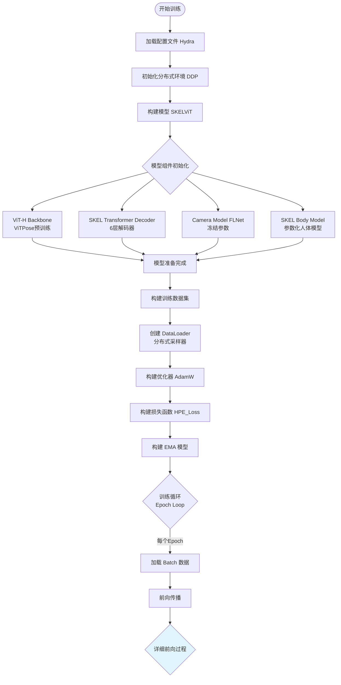
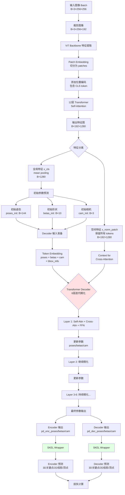
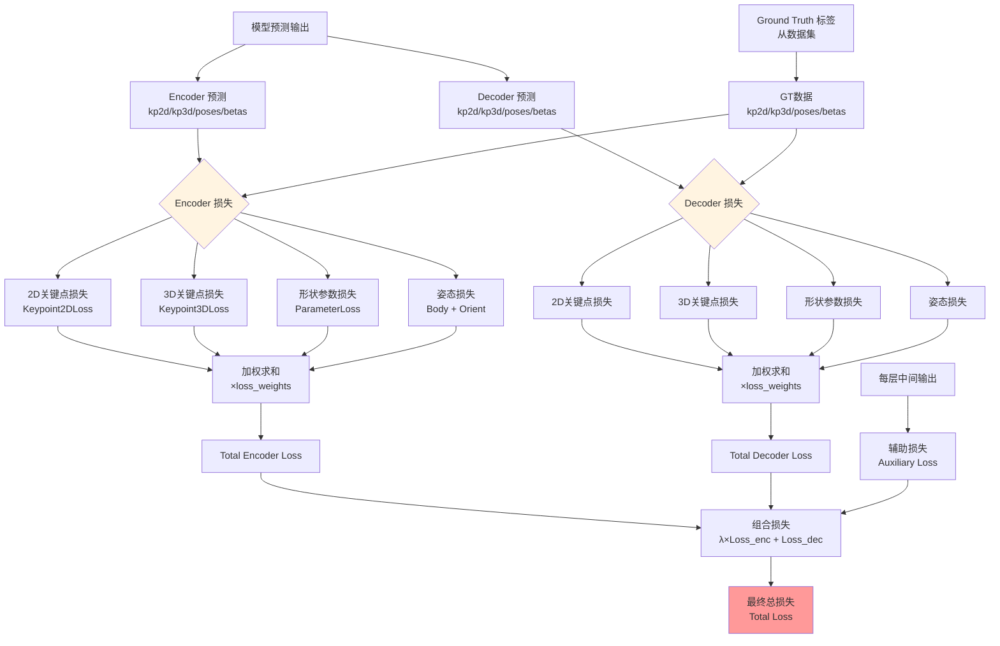
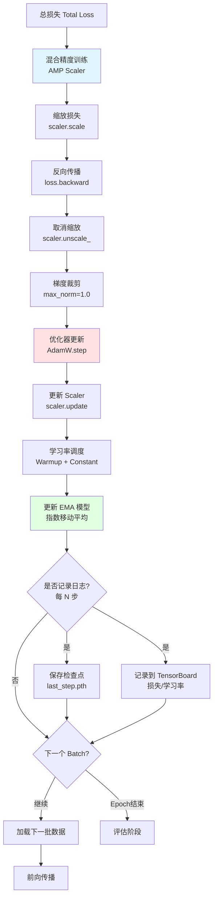
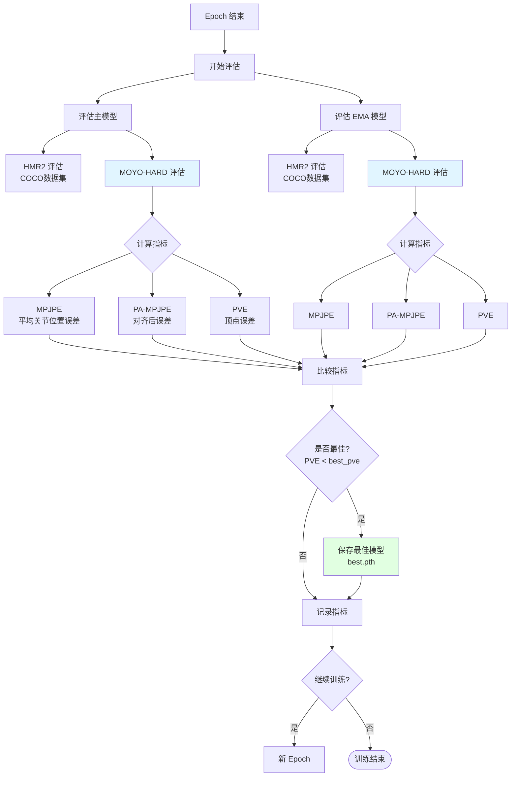
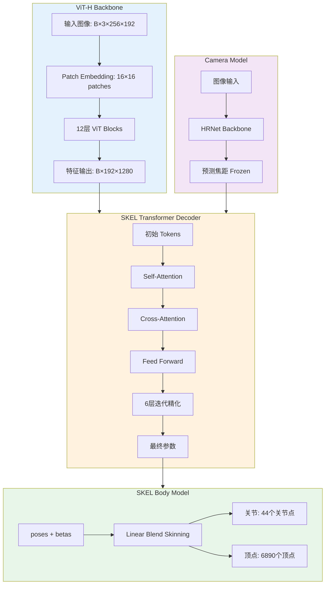
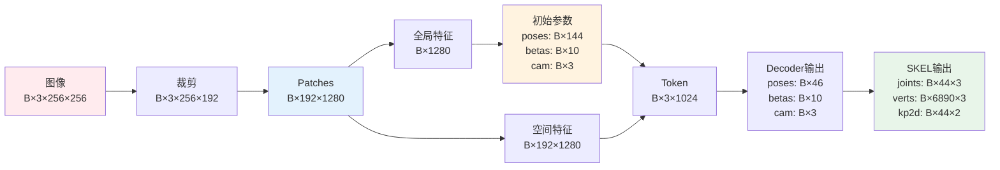
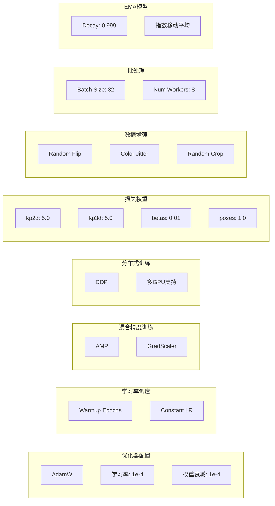
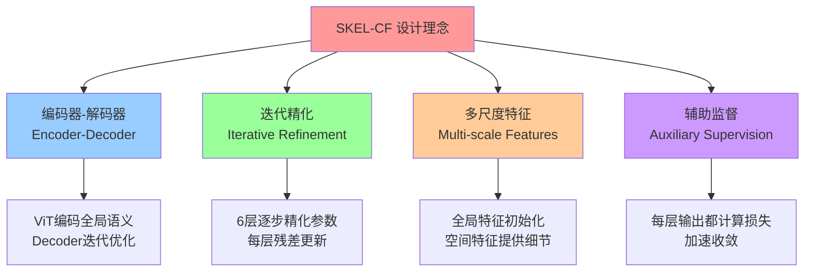

# SKEL-CF 训练模型流程图

## 📊 完整训练流程

## 🔄 前向传播详细流程

## 🎯 损失计算流程

## ⚙️ 反向传播与优化流程

## 📊 评估流程

## 🏗️ 模型架构详图

## 🔢 数据流维度变化

## 📈 训练参数配置

## 🎓 关键设计理念

---

## 📝 说明

以上流程图完整展示了 SKEL-CF 训练模型的：
- ✅ 完整训练循环
- ✅ 前向传播细节
- ✅ 损失计算机制
- ✅ 反向传播与优化
- ✅ 评估流程
- ✅ 模型架构
- ✅ 数据维度变化
- ✅ 核心设计理念

可以使用支持 Mermaid 的 Markdown 查看器（如 Typora、VS Code、GitHub）来渲染这些流程图。
